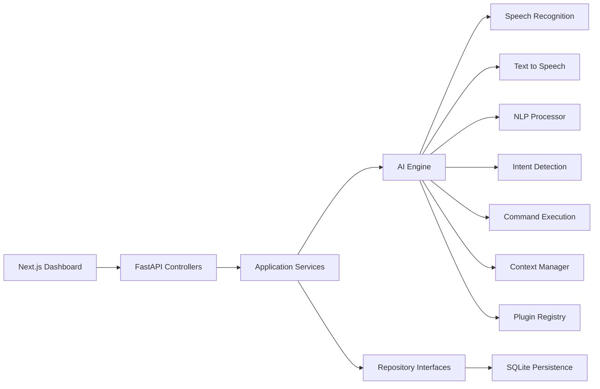

# Architecture

Jarvis follows Clean Architecture boundaries so the assistant can evolve from a local desktop app into a web platform and later into microservices.

## Layers

## Backend

- `controllers`: HTTP routes and request/response mapping.
- `services`: application use cases such as command handling, analytics, and users.
- `models`: domain dataclasses and API schemas.
- `repositories`: persistence interfaces and SQLite implementation.
- `configurations`: settings, logging, and dependency wiring.
- `security`: JWT creation, validation, and role checks.
- `utilities`: shared exceptions, IDs, and time helpers.

## AI Engine

- `speech_recognition`: local microphone adapter with typed fallback.
- `text_to_speech`: local pyttsx3 adapter with console fallback.
- `nlp`: normalization, tokenization, and entity extraction.
- `intent_detection`: rule-based intent detector, designed to be replaced by LLM/NLU providers.
- `command_execution`: command handlers and workflow automation.
- `context_management`: rolling conversation memory per user.
- `plugins`: extension points for specialized command handling.

## Frontend

- `app`: Next.js App Router pages and layout.
- `components`: dashboard, assistant, layout, and UI building blocks.
- `services`: typed API client.
- `store`: Zustand assistant state.
- `types`: shared frontend contracts.

## Microservices Migration Path

1. Move `ai_engine` into an independent inference service.
2. Replace SQLite with PostgreSQL and Redis.
3. Publish command events to Kafka, RabbitMQ, or AWS EventBridge.
4. Split workflow automation into a queue-backed worker.
5. Add API gateway authentication through Cognito, Auth0, Azure AD, or Okta.
