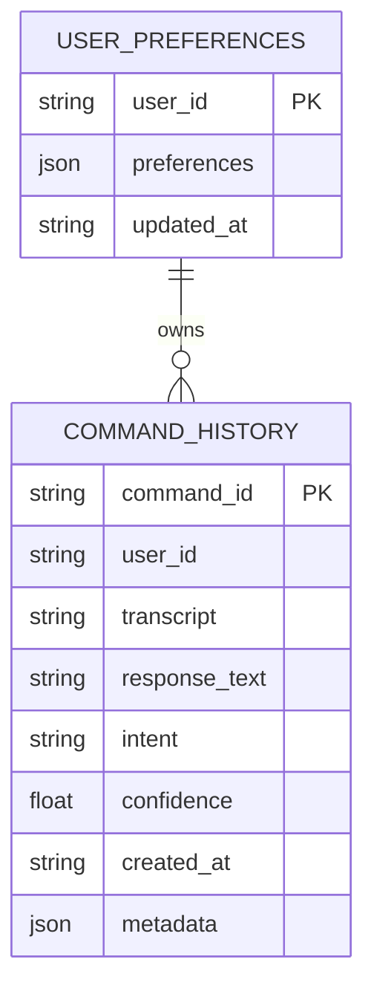

# Database Design

The current implementation uses SQLite for local development and portfolio demos. The repository interfaces are designed so SQLite can be replaced with PostgreSQL or another managed database later.

## Entity Relationship Diagram

## Tables

### `command_history`

Stores every assistant turn for command history, analytics, and conversation memory.

### `user_preferences`

Stores theme, voice, speech rate, wake word, notification, and confirmation preferences.

## Production Upgrade

Use PostgreSQL tables with these additions:

- `users`
- `roles`
- `conversation_sessions`
- `workflow_runs`
- `scheduled_commands`
- `plugin_installations`
- `audit_logs`

Add row-level access control, encrypted secrets, and retention policies for logs.
